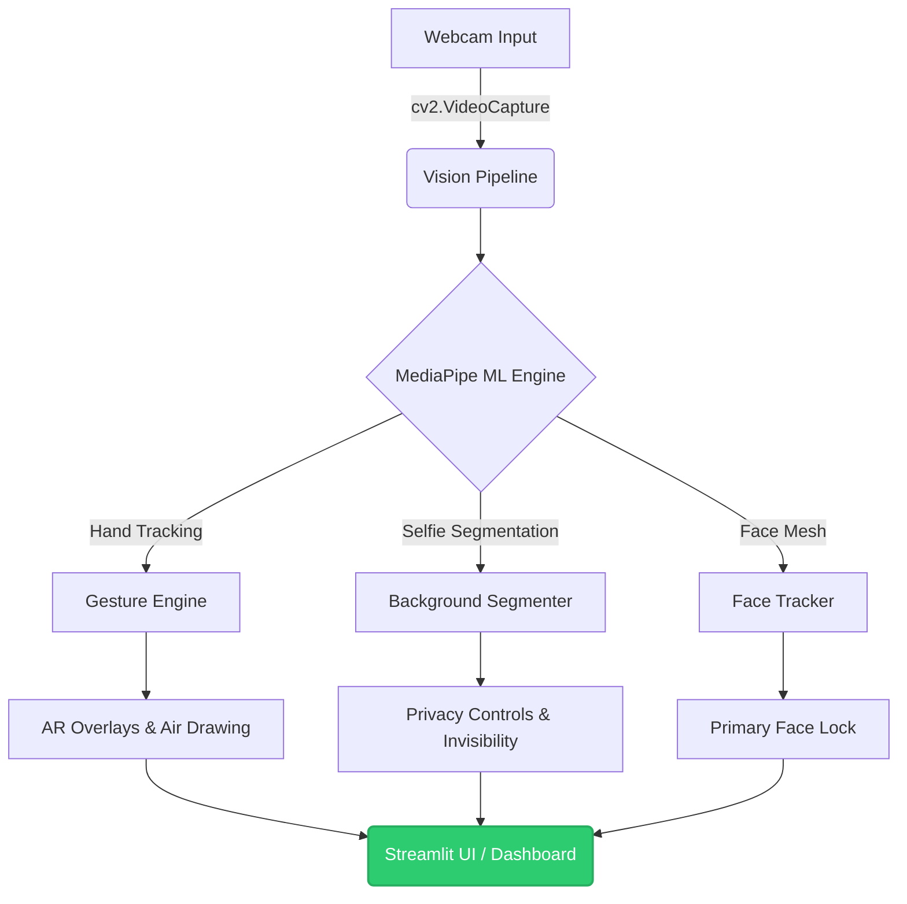

# 👻 GhostLens - Advanced AI Vision System

GhostLens is a state-of-the-art, real-time AI vision and augmented reality (AR) pipeline built in Python. Powered by Streamlit, MediaPipe, and OpenCV, it transforms your standard webcam into a high-performance gesture recognition and reality-bending tool with blazing-fast latencies (<35ms).

---

## ✨ Key Features

- **Background Segmentation:** Instantly swap between Normal Mode, Background Blur, and Full Invisibility.
- **Gesture Control:** Control the UI intuitively using your hands! 
  - ✋ **Open Palm:** Trigger background blur/invisibility.
  - 👍 **Thumbs Up:** Take a screenshot instantly.
  - 🤏 **Pinch:** Adjust invisibility level or trigger effects.
  - ☝️ **Pointing:** Start drawing in mid-air!
- **Privacy Controls:** Features like **Primary Face Lock** and **Blur Others** ensure only you remain in clear focus, securing your environment.
- **Live AI Telemetry:** Monitor pipeline performance in real-time, including FPS, Gesture Latency, Face Tracking status, and current modes.

---

## 📸 See it in Action

Check out GhostLens manipulating reality in real-time:

### Background Blur & Gesture Control

*Open Palm gesture detected and triggering background blur.*

### Gesture-Triggered Screenshots (Thumbs Up)

*A simple "Thumbs Up" instantly snaps a screenshot!*

### Real-Time Air Drawing

*Pointing your index finger lets you draw directly on the live feed.*

### Full Invisibility Cloak

*Full background segmentation removing the subject from the frame.*

---

## 🏗️ System Architecture

GhostLens uses a highly optimized concurrent architecture to ensure high framerates while running multiple deep learning models simultaneously.



---

## 🚀 Getting Started

### Prerequisites
- Python 3.10+
- A working webcam

### Installation
1. Clone the repository and navigate to the directory:
   ```bash
   git clone https://github.com/yourusername/GhostLens.git
   cd GhostLens
   ```

2. Create and activate a virtual environment:
   ```bash
   python3 -m venv venv
   source venv/bin/activate  # On Windows use `venv\Scripts\activate`
   ```

3. Install dependencies:
   ```bash
   pip install -r requirements.txt
   ```

4. Run the Streamlit Application:
   ```bash
   streamlit run app.py
   ```

---

## 🎮 Controls & Configuration

GhostLens can be controlled fully via gestures or through the intuitive Streamlit sidebar!
- Toggle **Demo Mode** for a clean, distraction-free presentation UI.
- Adjust **Blur Strength** dynamically to suit your environment.
- Control **Drawing Lifespan** for how long your mid-air art persists (e.g., 5 Seconds, Infinite).
- Enable **Face Follow Mode** to keep the camera tightly focused on you.

---

### Built with ❤️ using Python, OpenCV, MediaPipe, and Streamlit.
